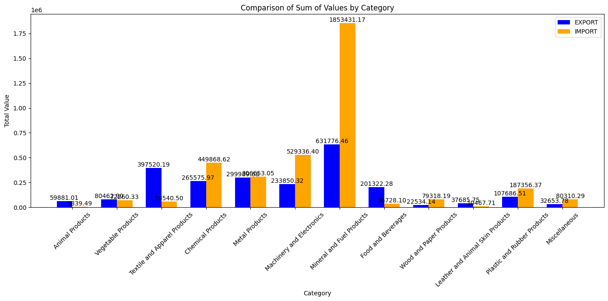
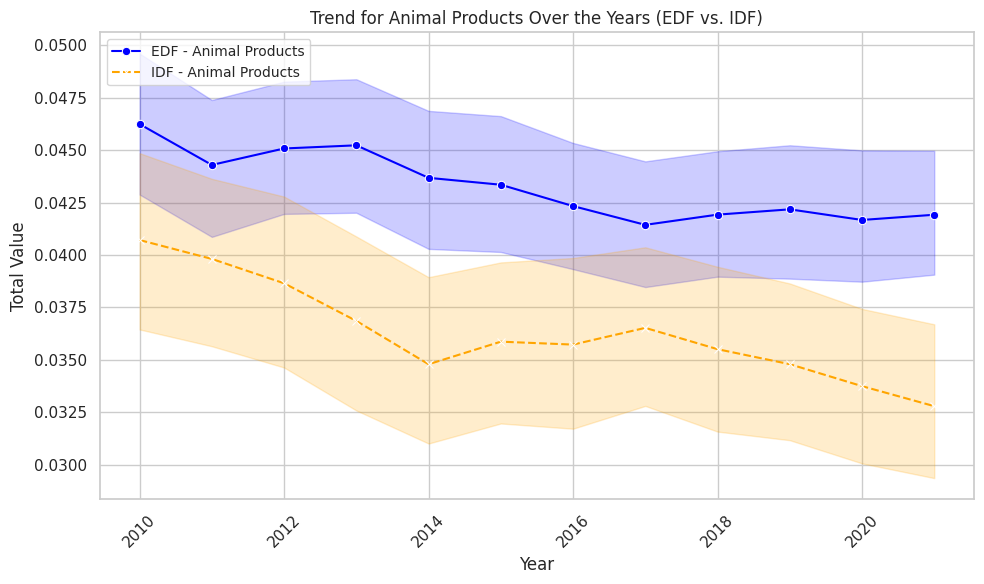

# Export Import Analysist
in this prjoect i will try to analyst export and import from india dataset

1. this datset contain 5 column. namely id,  commodity , value (price), year and country
2. for first step check dataset in export data there 10.4% from 184755 row is null in value and in import there 15.58% from 101051 row is null in value. there no dupiclate.but we will keep all row for analysis
3. after that extract all string in comodity unique value then imput all unique to ai text machine to make group by category
4. the category
    "Animal Products",
    "Vegetable Products",
    "Textile and Apparel Products" ,
    "Chemical Products",    "Metal Products",
    "Machinery and Electronics",
    "Mineral and Fuel Products",
    "Food and Beverages",
    "Wood and Paper Products",
    "Leather and Animal Skin Products",
    "Plastic and Rubber Products",
    "Miscellaneous"
5.  after make the new column and one hot encoding if that word in category
6.  After that make graph for analysis
7.  

8.  
9.   .png)
10.   .png)
11. [My Image](picture/download(3).png)
1.  .png)
13   .png)
14.   .png)
15. [My Image](picture/download(7).png)
1.  .png)
17   .png)
18.   .png)
19..png)
